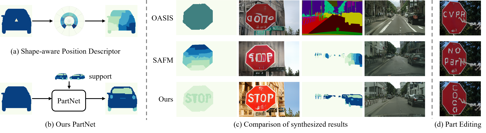

# [Inferring and Leveraging Parts from Object Shape for Improving Semantic Image Synthesis](https://arxiv.org/abs/2305.19547)


## Method Details



We propose a method iPOSE to infer parts from object shape and leverage them to improve semantic image synthesis. It can generate more photo-realistic parts from the given semantic map, while having the flexibility to control the generated objects

## Quick Start


### Environment Setup

```
git clone https://github.com/csyxwei/iPOSE.git
cd iPOSE
conda create -n ipose python=3.7.6
conda activate ipose
pip install torch==1.7.1+cu110 torchvision==0.8.2+cu110 torchaudio==0.7.2 -f https://download.pytorch.org/whl/torch_stable.html
pip install -r requirements.txt
```

### Preparing Dataset

Please follow the instructions to prepare COCO-Stuff, Cityscapes or ADE20K datasets as outlined in [SPADE](https://github.com/NVlabs/SPADE). Besides, we get the instance maps of ADE20K from [instancesegmentation](http://sceneparsing.csail.mit.edu/data/ChallengeData2017/annotations_instance.tar).

The part dataset we used can be downloaded from [GoogleDrive](https://drive.google.com/file/d/1vZFrXQg1TnhMJh8c_g7o8bXJg5oV9nLC/view?usp=sharing).

For COCO, we employ [./utils/coco_util/create_ins_dict.py](./utils/coco_util/create_ins_dict.py) to preprocess the instantce parameters for fast training.

The final data structure is like this:

```
datasets
├── Cityscapes
│  ├── leftImg8bit
│  ├── gtFine
│  ├── ...
├── ADEChallengeData2016
│  ├── images
│  ├── annotations
│  ├── annotations_instance
│  ├── ...
├── COCO
│  ├── train_img
│  ├── train_label
│  ├── train_inst
│  ├── val_img
│  ├── val_label
│  ├── val_inst
│  ├── train_dict.npy
│  ├── val_dict.npy
│  ├── ...
├── Full_Parts
│  ├── ...
```

### Testing

Downloading pretrained models from [GoogleDrive](https://drive.google.com/drive/folders/1Vz5j6PaLl_tPDacGTdJSVyiA8UH74Ftp?usp=sharing) and save them under `./checkpoints`.

After that, you can use the provided testing scripts in [`scripts`](./scripts) for testing and evaluation. For example,

```
bash scripts/test_ade20k_ipose.sh
```

### Training

You can use the provided training scripts in [`scripts`](./scripts) to train your model. For example,

```
bash scripts/train_ade20k_ipose.sh
```

## Citation

---

```
@inproceedings{wei2023inferring,
  title={Inferring and leveraging parts from object shape for improving semantic image synthesis},
  author={Wei, Yuxiang and Ji, Zhilong and Wu, Xiaohe and Bai, Jinfeng and Zhang, Lei and Zuo, Wangmeng},
  booktitle={Proceedings of the IEEE/CVF Conference on Computer Vision and Pattern Recognition},
  pages={11248--11258},
  year={2023}
}
```

## Acknowledgments

This code is built on [SPADE](https://github.com/NVlabs/SPADE) and [OASIS](https://github.com/boschresearch/OASIS). We thank the authors for sharing the codes.